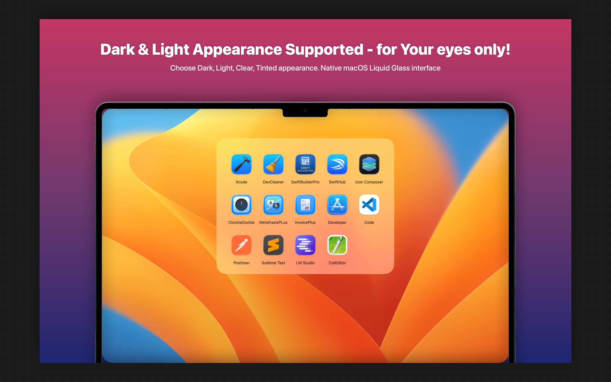
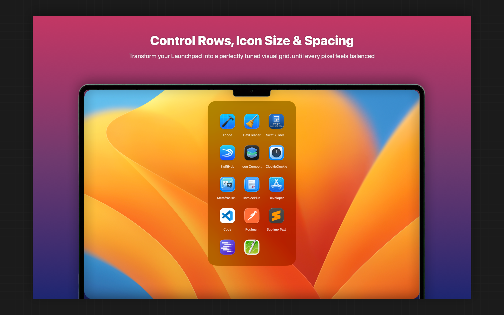

# AppShelf

# 🚀 AppShelf  
### A fast, elegant macOS launcher that opens your favorite apps from one clean, focused grid.

---

## ✨ Why AppShelf

AppShelf gives you instant access to your essential apps—without Dock clutter, without distractions, and without breaking your workflow.

- Open your launcher with a global shortcut  
- Keep a clean, minimal grid of only the apps you choose  
- Customize the layout (Pro) to match your exact style  
- Enjoy a native, lightweight macOS experience  

---

## 🧩 Features

- ⚡ **Quick launcher window** for your selected apps  
- ⌨️ **Global hotkey** to show/hide the launcher  
- 🖱️ **Drag & drop** to rearrange apps  
- ➕ **Add / remove apps** from Settings  
- 🔄 **Launch at Login** option  
- ⏱️ **Idle auto‑hide** option  
- 🌍 **Localized in 16 languages**

---

## 💎 Free vs Pro

### **Free**
- Up to **8 apps**
- Fixed defaults:
  - Columns: **4**
  - Icon size: **72**
  - Icon spacing: **0**
  - Idle hide delay: **0**

### **Pro (Lifetime — one‑time purchase)**
- **Unlimited apps**
- **Appearance customization**:
  - Columns  
  - Icon size  
  - Icon spacing  
  - Idle hide delay  
- **Shortcut customization**:
  - Modifier keys  
  - Activation key  
- **Restore Purchases** support

---

## 🌐 Localization

AppShelf is fully localized in:

- English  
- Arabic  
- Arabic (UAE)  
- German  
- Greek  
- Spanish  
- French  
- Hindi  
- Italian  
- Japanese  
- Korean  
- Portuguese (Brazil)  
- Romanian  
- Turkish  
- Chinese (Simplified)  
- Chinese (Traditional)

---

## 🔗 Links

- 📘 **README**: https://ops-eng.github.io/AppShelf/README.md
- ❓ **Help**: https://ops-eng.github.io/AppShelf/help.html
- 🔒 **Privacy**: https://ops-eng.github.io/AppShelf/privacy.html
- 🛠️ **Support**: https://ops-eng.github.io/AppShelf/support.html

---

## 📝 Notes

- A local **StoreKit (.storekit)** configuration is used for development/testing.  
- **Release/Archive** builds must use real App Store Connect products (no StoreKit simulation).

---

## 👨‍💻 Developer

Built with care by **Efthymios Tampouris**.

---

